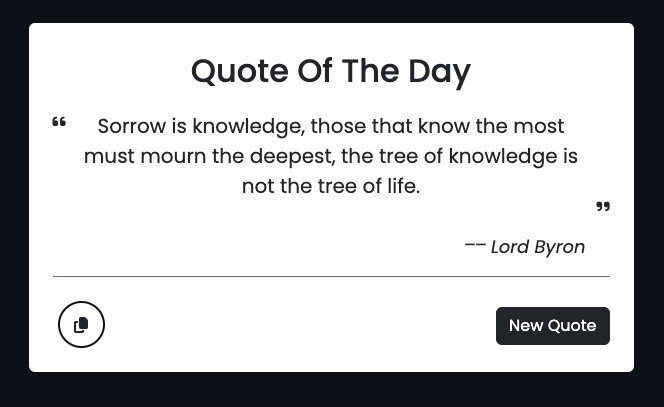

# Quote Generator Project



## Overview

The Quote Generator is a simple web application that displays a random quote and its author. Users can generate new quotes and copy the displayed quote to their clipboard.

## Features

- **Random Quote Generation**: Fetches a random quote from an API.
- **Copy to Clipboard**: Allows users to copy the current quote.
- **Responsive Design**: Adapts to different screen sizes.

## Technologies Used

- **HTML5**: For structuring the web page.
- **CSS3**: For styling. Utilizes Bootstrap for responsive design and custom styles defined in [main.css](css/main.css).
- **JavaScript**: For dynamic interactions and fetching quotes from an API.
- **Font Awesome**: For icons.

## Project Structure

- [index.html](index.html): The main HTML document that contains the application.
- [css/](css/): Contains all CSS files including Bootstrap and custom styles.
- [js/](js/): Contains JavaScript files for dynamic behavior.
- [images/](images/): Directory for image assets like favicons.

## Setup and Usage

1. Clone the repository.
2. Open [index.html] in a web browser to run the application.

## Code Highlights

- Fetching and displaying quotes:

```7:12:js/main.js
function randomQuote() {
    fetch("https://api.quotable.io/random").then(res => res.json()).then(result =>{
        console.log(result);
        quoteText.innerText = result.content;
        authorName.innerText = result.author;
    })
```

- Event listeners for buttons:

```15:19:js/main.js
copyBtn.addEventListener("click", ()=>{
    navigator.clipboard.writeText(quoteText.innerText);
});

quoteBtn.addEventListener("click", randomQuote);
```

## Contributing

Feel free to fork the repository and submit pull requests. 🚀

## License

This project is open-sourced under the MIT license.

---

🌟 Enjoy coding and sharing quotes!
